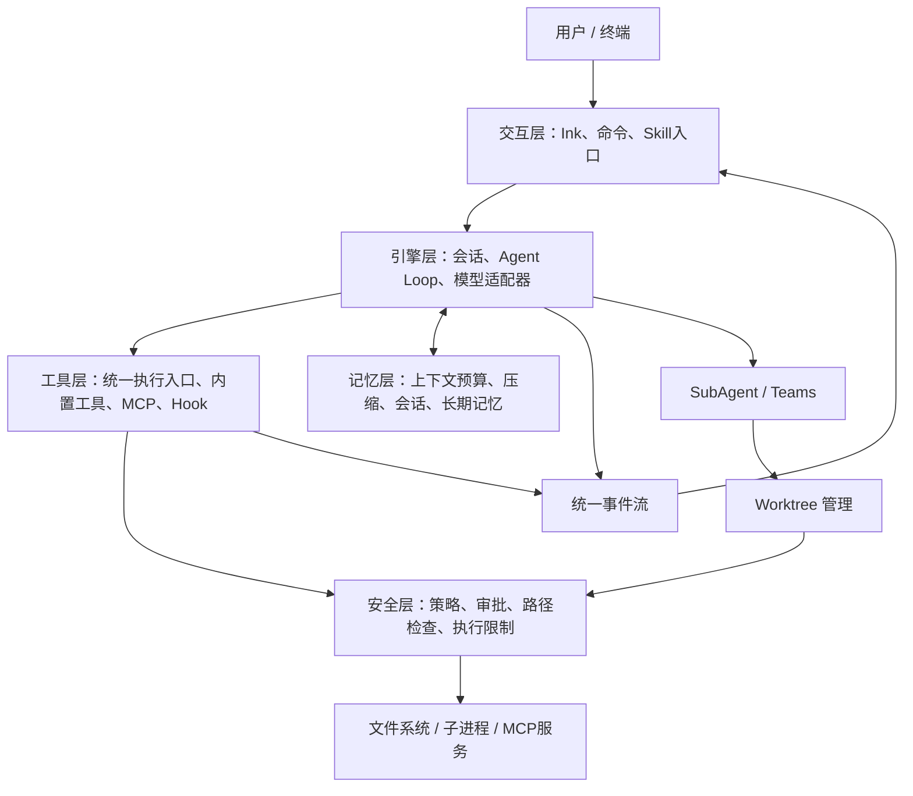

# MewCode Agent：技术栈与总体设计

状态：方案已确认，M01–M03已完成本地验收；下一模块为M04 Agent Loop。主语言为 TypeScript + Node.js。

整理日期：2026-10-05（Asia/Shanghai）。参考来源：[公开项目介绍](https://xiaolincoding.com/project/mewcode.html)，详见[网页提取记录](00-网页内容提取.md)。

## 1. 范围与仓库现状

目标是实现一个可以在真实代码仓库中工作的 CLI Coding Agent：接收自然语言任务，查询和修改文件，运行命令，观察结果并继续执行，同时支持权限控制、上下文管理与后续扩展。

公开网页与方案已完成整理；用户确认继续后，按模块实现、验收和调优。初次仓库与环境检查记录如下。

仓库：`https://github.com/hqyx2025/MewcodeAgent.git`，默认分支 `main`。本次检查的基础提交为 `e272212507dbd5b22023b4ad3cd24e42f31c44f3`，只有 `README.md` 和 `LICENSE`（Apache 2.0），没有可复用的业务模块或已有测试。

当前机器为 Node.js `v24.14.0`、npm `11.9.0`。M01/M02已完成Windows本地检查、生产依赖安装、终端双轮对话及真实模型冒烟；详见[M02验收记录](modules/M02/checklist.md)。Linux/macOS与远程CI结果另行记录。

### 内容来源如何区分

- **网页明确内容**：13 项主要能力、五层架构、四种语言版本、Spec 开发模式，以及图片中的技术栈和 17 章目录。
- **本仓库补充方案**：Node.js 替代 Bun、具体依赖、目录设计、权限五层的定义、API 类型、存储格式、实施顺序及验收指标。
- **尚未获得的资料**：完整章节正文、完整源码、课程内部提示词、课程精确的权限五层细节。后续如提供这些资料，再做差异核对。

## 2. 技术栈决策

### 2.1 网页中的 TS 技术栈

网页技术栈图片列出：Bun + TS5、Ink、Anthropic SDK、OpenAI SDK、MCP SDK、js-yaml、node:http、bun:test。

用户已选择 **TypeScript + Node.js**。保留 Ink 与协议适配思路，将 Bun 的构建、执行及测试环节替换为 Node.js 生态方案。

### 2.2 本仓库建议采用的技术栈

| 领域 | 建议选择 | 作用与理由 | 引入阶段 |
| --- | --- | --- | --- |
| 运行时 | Node.js 24 LTS，ESM | 与当前机器一致；使用标准文件、流和子进程 API | M01 |
| 语言 | TypeScript 5，严格模式 | 通过类型约束消息、工具、事件和状态转换 | M01 |
| 包管理 | npm，提交 package-lock.json | 单项目起步，减少环境差异；CI 使用 npm ci | M01 |
| 开发与构建 | tsx + tsup | 开发直接执行 TS，发布编译后的 CLI；生产不依赖 tsx | M01 |
| 终端 UI | Ink + React | 与网页 TS 栈一致，以组件消费引擎事件 | M02 |
| CLI 参数 | Commander | 管理 help、version、model、cwd、resume 等启动参数 | M01–M02 |
| 输入与工具校验 | Zod + JSON Schema 导出 | 配置、工具输入和持久化记录共用可校验的契约 | M01、M03 |
| 首个模型适配器 | OpenAI 兼容 Chat Completions / Responses + openai SDK | 可配置协议；用户端点采用Responses，工具调用在后续模块验证 | M02 |
| 第二个模型适配器 | Anthropic SDK | 对齐网页的 Anthropic 工具调用语义，通过统一接口接入 | M04 后 |
| MCP | @modelcontextprotocol/sdk | 先 stdio，再 Streamable HTTP；不自行重造 JSON-RPC | M07 |
| 配置 | YAML（js-yaml）+ 环境变量 | 便于项目级、用户级配置；密钥使用环境变量引用 | M01 |
| 搜索 | ripgrep（rg）+ Node.js opendir + picomatch | Grep保留rg忽略规则；Glob有界枚举且从固定目录前缀起步 | M03 |
| 文件与命令 | node:fs/promises + node:child_process | 读写、原子替换、超时、取消、工作目录及进程生命周期 | M03 |
| 会话与记忆 | JSONL 会话日志 + Markdown 记忆文件 | 易检查、易恢复；先不引入数据库 | M08–M09 |
| 日志与诊断 | pino，输出到独立日志文件 | 结构化事件与审计；避免污染 TUI、MCP 标准输出 | M01 后逐步完善 |
| 测试 | Vitest + 临时目录 + 本地模拟模型/MCP 服务 | 默认无需密钥与联网；真实模型冒烟测试单独运行 | M01 起 |
| 质量检查 | ESLint + Prettier + tsc --noEmit | 保持风格和类型检查一致 | M01 |
| 发布 | npm bin + 编译产物 | 先支持 Node.js 安装方式，后续再评估独立可执行文件 | M16 |

依赖版本以package.json和锁文件为准；M02已引入Ink8.0.0、React19.3.0与openai7.28.0，并验证两种流式协议和独立安装。其余未来模块依赖仍需在引入时核对兼容性。

首个模型实际采用用户配置的gpt-5.5、doufuapi.com/v1与Responses，固定store:false；同时保留Chat Completions适配。其他供应商、模型名称、base URL、上下文窗口和价格由用户配置。所谓“兼容端点”不保证支持所有能力，要验证streaming、tool calling、usage等能力；工具调用在后续模块接入。CLI的API凭据独立配置。

### 2.3 这次的工程取舍

- 先采用单包、模块化目录，便于逐章开发；后续有稳定边界后再评估拆包。
- Agent Loop 自行实现，以便学习协议、停止条件、工具执行和上下文管理。
- 首阶段不引入 Web 后端、数据库、向量检索或通用 Agent 编排框架；MVP 聚焦本地 CLI 闭环。
- Hook、Skill、MCP 和子 Agent 都复用统一工具与权限入口。
- 优先支持 Windows PowerShell；核心路径与文件逻辑同时测试 Linux，随后验证 macOS。

## 3. 五层架构与依赖边界

网页把系统分为交互、引擎、工具、记忆、安全五层。实现时安全策略是所有执行动作的公共约束，记忆为引擎提供上下文，不强行做成五个串行服务。



依赖规则：UI 订阅事件、提交用户操作，不直接执行文件或 shell 动作；引擎依赖工具接口，不依赖 React；模型适配器转换协议，不承担路径检查；每个 agent 都必须通过统一执行入口。源码的循环依赖在 M01 建立检查约束。

## 4. 建议目录

以下是全项目规划。M01–M03已创建cli、ui、config、core、providers、tools、security、shared及测试目录，其余模块按对应阶段建立。

```text
src/
  cli/            启动入口、参数、交互模式
  ui/             Ink组件、事件投影、输入与审批界面
  core/           AgentLoop、Session、事件与任务状态
  providers/      统一模型接口、OpenAI兼容与Anthropic适配
  tools/          工具契约、注册表、执行器、六个内置工具
  security/       权限决策、路径校验、审批与审计
  mcp/            连接、发现、调用、生命周期与命名空间
  context/        token预算、压缩、溢写与恢复
  memory/         用户/项目记忆、筛选、更新
  commands/       Slash Command注册与解析
  skills/         SKILL.md发现、元信息与按需加载
  hooks/          生命周期事件、运行器
  agents/         子Agent、队列、并发、Teams
  worktrees/      Git工作树创建、回收、差异汇总
  config/         配置加载、合并与校验
  storage/        会话日志、原子写入、迁移
  shared/         少量跨模块基础类型与错误
tests/
  unit/           纯逻辑与边界测试
  integration/    模拟模型、工具、权限、MCP与会话回放
  fixtures/       小型仓库、确定性模型响应与失败场景
docs/
  00-网页内容提取.md
  01-技术栈与总体设计.md
  02-模块实施与验收.md
  modules/<模块>/ spec.md、tasks.md、checklist.md（到模块开发时再建）
```

## 5. 核心数据与执行协议

### 5.1 模型与事件

模型适配器对外提供 `stream(request, signal): AsyncIterable<LLMEvent>`，输出统一的 `text_delta`、`tool_call_delta`、`usage`、`finish` 和 `error` 事件。

消息包含 `role` 与内容块；工具调用块必须保存 `callId`、名称和参数，结果块必须关联同一 `callId`。内部格式与供应商格式分开，便于跨供应商转换与会话回放。

UI 的 `AgentEvent` 使用稳定的判别字段，例如 `text_delta`、`tool_started`、`tool_finished`、`approval_requested`、`usage_updated`、`run_finished`。每个事件携带 sessionId/runId，涉及工具时携带 callId，避免并行输出串线。状态展示使用模型文本和执行事件，不要求模型输出隐藏思维链。

### 5.2 工具

每个工具声明名称、描述、输入 Schema、读写性质、允许模式及执行函数。统一结果包含 `ok`、可呈现内容、错误码、截断信息和可选外部结果引用。

统一执行顺序：解析完整参数 → Schema 校验与初步deny判断 → 单独授权并执行PreToolUse Hook → 对最终参数重新校验、准备目标与授权 → 执行 → PostToolUse Hook → 记录结果 → 返回模型。Hook脚本本身按shell效果审批，修改后的实际操作必须重新检查；原工具审批绑定最终参数，避免为尚未实际执行的旧参数重复审批。M12的协议与失败策略见[规格](modules/M12/spec.md)。

六个内置工具：

| 工具 | 本仓库约定 |
| --- | --- |
| ReadFile | 支持行区间、大小限制、编码和二进制识别；返回行号 |
| WriteFile | 原子写入；区分创建与覆盖；覆盖展示差异并检查文件版本 |
| EditFile | 精确文本替换，默认必须唯一匹配；变更前核对读取版本，避免覆盖他人修改 |
| Bash | 保留网页名称；通过 ShellAdapter 区分 PowerShell/Bash，显式记录 shell、cwd、超时、退出码 |
| Glob | 支持忽略规则、隐藏文件策略、数量上限；匹配结果局限于授权根目录 |
| Grep | 使用 rg；支持正则/字面量、路径过滤和上下文行；区分无匹配与执行失败 |

Windows 上 `Bash` 不代表自动存在 bash.exe。`Bash` 工具默认映射配置好的 PowerShell 执行器；确需 Bash 语义时选择已安装的 Git Bash，并向模型声明。避免将 PowerShell 语法交给 Bash 或反之。

### 5.3 Agent Loop

```text
用户输入 → 组装预算内上下文 → 发起模型流式请求
  ├─ 未请求工具且正常结束 → 返回答案，结束本轮
  ├─ 请求工具 → 完整组装调用 → 校验/授权 → 执行 → 回填结果 → 下一轮
  └─ 错误/取消/达到预算 → 保存已完成记录，明确结束原因
```

停止条件包括正常文本结束、最大轮数、token/费用预算、截止时间、重复失败和用户取消。无工具调用只是正常协议结束的一种情况；输出截断、限流或服务端异常不能按成功完成处理。流式参数尚未完整时不执行工具。

可证明独立的只读工具允许有界并发；修改文件或执行命令默认串行。暂停审批、取消和状态转换必须有确定性测试。用户取消后阻止新调用，并清理当前进程；已完成的修改保留在日志中。

## 6. 权限与工作模式

网页提出“五层纵深权限防御”，未在公开正文细化五层。下面是本仓库的补充定义：

| 层 | 检查点 | 主要实现 |
| --- | --- | --- |
| 1 | 模式与工具能力 | Plan 模式只读；子 Agent 继承父级权限且可进一步收紧 |
| 2 | 路径与资源边界 | 规范化绝对路径，解析符号链接/junction、Windows大小写与UNC；默认限制在项目根内 |
| 3 | 操作与参数风险 | 区分读取、覆盖、删除、网络、命令执行；复杂或未知 shell 表达式默认要求审批 |
| 4 | 人工审批与授权范围 | allow/ask/deny；一次、当前会话、项目规则；展示最终参数与差异 |
| 5 | 执行限制与记录 | 超时、输出/并发上限、取消、审计、Worktree隔离；后续评估操作系统沙箱 |

Worktree 只隔离 Git 工作文件，不能阻止网络访问、仓库外读写或主机级破坏。普通子进程同样不是安全沙箱。第一版对 shell 和外部 MCP 能力依赖明确审批与资源限制，发布文档需准确说明此边界。

模式建议：`plan`（只读规划）、`default`（按规则授权）、`accept-edits`（允许项目内常规文本编辑，命令仍受策略约束）。第一版不提供全局无条件放行模式。

密钥从环境变量解析，不写入会话或记忆；日志脱敏。文件、网页、MCP 返回内容视为任务数据，不能自行提升权限。MCP 服务标注的只读属性仅作提示；未知外部工具仍要独立授权。

## 7. 上下文、持久化与记忆

- 输入预算 = 模型窗口 − 输出预留 − 工具/系统提示开销 − 安全余量；阈值按配置计算。
- usage 优先使用供应商回传；本地 token 计数明确标记为估算，不能把所有模型套用一个精确分词器。
- 压缩前保留用户目标、权限约束、未完成任务、文件修改摘要、重要错误和完整工具调用/结果对。
- 大工具结果存入会话专属文件，正文返回摘要和可检索引用。溢写目录本身受权限控制；会话清理时一起清理。
- 压缩生成新摘要后，先校验、落盘，再切换上下文；失败保留原消息。系统提示和长期记忆按独立区域注入，避免刚注入就被丢弃。
- 用户存储建议 `~/.mewcode/`；项目配置、命令、Skill和记忆使用项目内 `.mewcode/`。会话与缓存默认存用户目录，避免误提交。
- 会话 JSONL 带 schemaVersion、事件序号与检查点；恢复时检测尾部不完整记录。恢复不重复执行已经完成的写入、shell 或 MCP 调用。
- 记忆更新先形成候选，用户可查看、修改、删除；未明确允许的敏感信息不持久化。用户级与项目级按相关性、大小预算注入，暂不依赖向量库。

## 8. 扩展与多 Agent

MCP：先验证 stdio 的 initialize、tools/list、tools/call、超时和退出清理，再补远程传输。工具使用 `mcp:<server>:<tool>` 命名空间；重连后重新发现工具。远程鉴权单独配置，错误返回不能破坏主会话。

Slash Command：内置 `/help`、`/clear`、`/model`、`/permissions`、`/compact`、`/resume`、`/plan`；用户命令定义参数与 prompt 模板。自定义命令的加载和后续动作服从同一权限策略。

Skill：发现项目级和用户级 SKILL.md，启动时只加载元信息，匹配时读取正文和资源；资源路径限制在技能目录。技能是可加载指令与资源，执行动作仍由统一工具处理。

Hook：统一 SessionStart、PreToolUse、PostToolUse、Stop、SessionEnd；支持结构化返回、超时、错误策略。Hook 的子进程执行本身受权限管控；默认不将整个环境变量集传给脚本。

SubAgent：独立上下文、状态和取消信号，父 Agent 只接收任务结果与必要引用；并发数和整体费用预算共享约束。M13 先允许只读子任务；代码写入在 M14 有 Worktree 后开启。

Worktree：记录仓库、分支、路径、归属与状态。存在未提交变更的工作树不能自动丢弃；清理前保留差异。所有子进程 cwd 显式绑定工作树，不自动合并回主分支。

Teams：在 SubAgent 与 Worktree 稳定后实现长期成员、任务领取、消息队列、交付物和冲突汇总。第一版限定单机；任务消息持久化并去重，不允许互相消息无限触发。

## 9. 调优与发布准则

先建立基准，再优化。每个模块记录正确性、首个可见输出延迟、工具耗时、重绘频率、token/费用、上下文大小、并发数与内存；区分本地模拟开销和真实模型网络耗时。

优化优先级：修正执行与恢复错误 → 阻止权限绕过 → 限制大结果与重复调用 → 合并 UI 更新 → 有界并发 → 降低提示词与压缩成本。保持固定测试任务、相同模型配置和可重复输入，才能比较前后结果。

真实模型输出不确定。CI 使用确定性模拟服务；真实模型另做小规模 smoke/evaluation，并记录模型、日期、参数和费用。

## 10. 审阅重点

1. 已确定主语言 TypeScript + Node.js；是否接受 Node.js 24 LTS、Ink、npm 单包起步的组合。
2. 首个模型端点已确认并试连；后续主循环采用自行实现、供应商适配器独立的方式。
3. 是否接受先完成 M01–M06 的可用核心，再扩展到上下文、MCP及多 Agent。
4. 初版以 Windows 为主要人工验证环境，同时用 Linux CI 检查跨平台逻辑。
5. 默认命令执行与写入权限边界、后续 SubAgent 写入必须使用 Worktree 的约定。

确认后以[逐模块实施计划](02-模块实施与验收.md)为执行依据，不一次性铺开全部模块。
