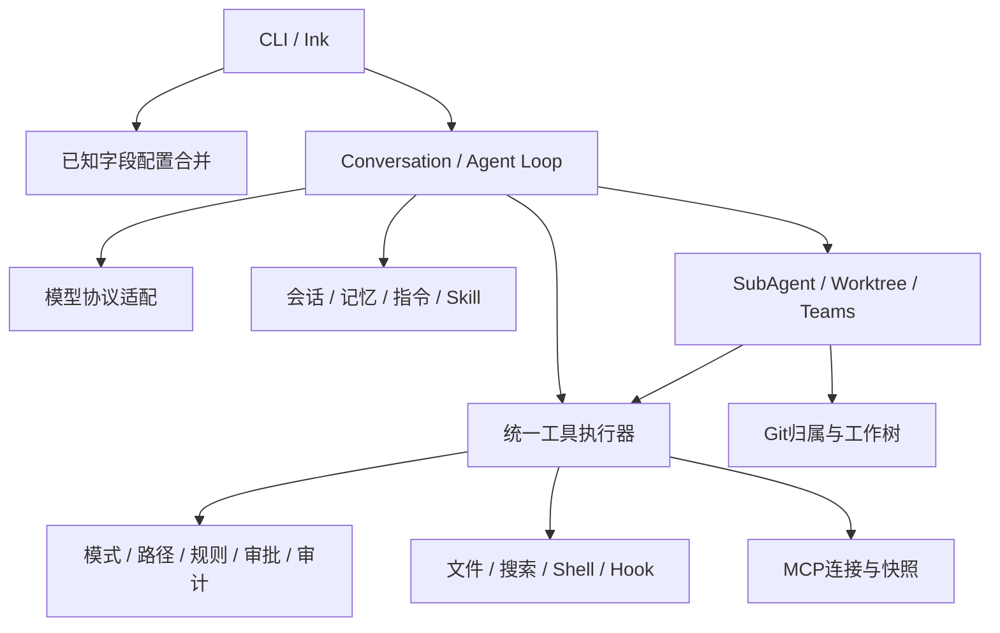

# 架构复盘与调优取舍

本轮复查对象为M01–M15的实际代码，工程边界仍由dependency-cruiser验证。核心不引用CLI/Ink/React，shared保持基础叶模块。CLI延迟加载业务模块，help/version独立安装测试阻止加载配置、UI和SDK重依赖。

| 层 | 复查结论 | 约束与证据 |
| --- | --- | --- |
| 配置/provider | 配置字段和协议适配独立；模型数据不改变配置权限 | config、provider-tools、responses测试 |
| 工具/权限 | 文件、shell、Hook、MCP和协作复用执行入口 | permissions、hooks、mcp和team边界回归 |
| 提示/历史 | 指令与摘要作为数据；权限由执行器判断 | prompt-regression、context、长会话评估 |
| 持久化 | 会话、记忆、工作树、团队格式拥有不同生命周期 | 各存储归属/锁/损坏/恢复测试 |
| 协作 | 只读子任务、写入工作树、团队共同复用子池与预算 | 本轮两工作树修复/检查/保守清理评估 |
| UI | 文本30ms合并刷新，生产Ink最多30fps；退出取消流 | chat-ui回归、1000分片Profiler基准 |

没有把不同语义的类型强行合并：会话动作账本、团队claim预算、工作树lease与消息指纹各自有明确归属。M15的持久结果Schema与运行时结果类型分别约束磁盘输入和执行返回，交付测试同时核验。没有新增模型可写的权限配置或绕过工具的执行接口。

本轮确认的重复CPU工作是压缩时先格式化全部历史摘录，最后再按预算截断。现在先计算覆盖全部历史的摘要指纹，只格式化展示预算内的摘录；系统提示、原目标、最近完整调用组和全部历史指纹保持原语义。回归包含更改已省略的历史仍改变指纹、最小预算、完整调用组、近期目标与真实100轮持久恢复。

整体场景里Git子进程与归属/fsync检查比压缩CPU耗时更大，但本轮不以缓存跨动作归属或跳过落盘来降低耗时。工作树不是OS沙箱，修改动作与记录不是跨文件事务；错误时保留可核验线索优先。搜索已支持明确目录前缀和有界结果，本轮万文件测量确认缩小到src可减少扫描，保持5条预期结果和明确截断。

内存只记录评估结束及UI基准结束的heapUsed，不把不同场景或保留帧的测试渲染器增长解释为泄漏/无泄漏结论。长期真实模型、大仓库、真实终端帧率、GC峰值和付费金额仍需单独测量。取消/退出后的进程清理由实际MCP父子进程存活检查和既有Shell/Hook取消测试支撑。

临时测试目录现在必须来自本进程helper创建记录，删除前核对精确根、规范临时父目录、目录类型与realpath；相似前缀和子目录都拒绝。macOS规范路径处理避免把/tmp或/var别名误当成不同项目。此约束用于测试夹具，不给用户工作树提供自动强制清理。
