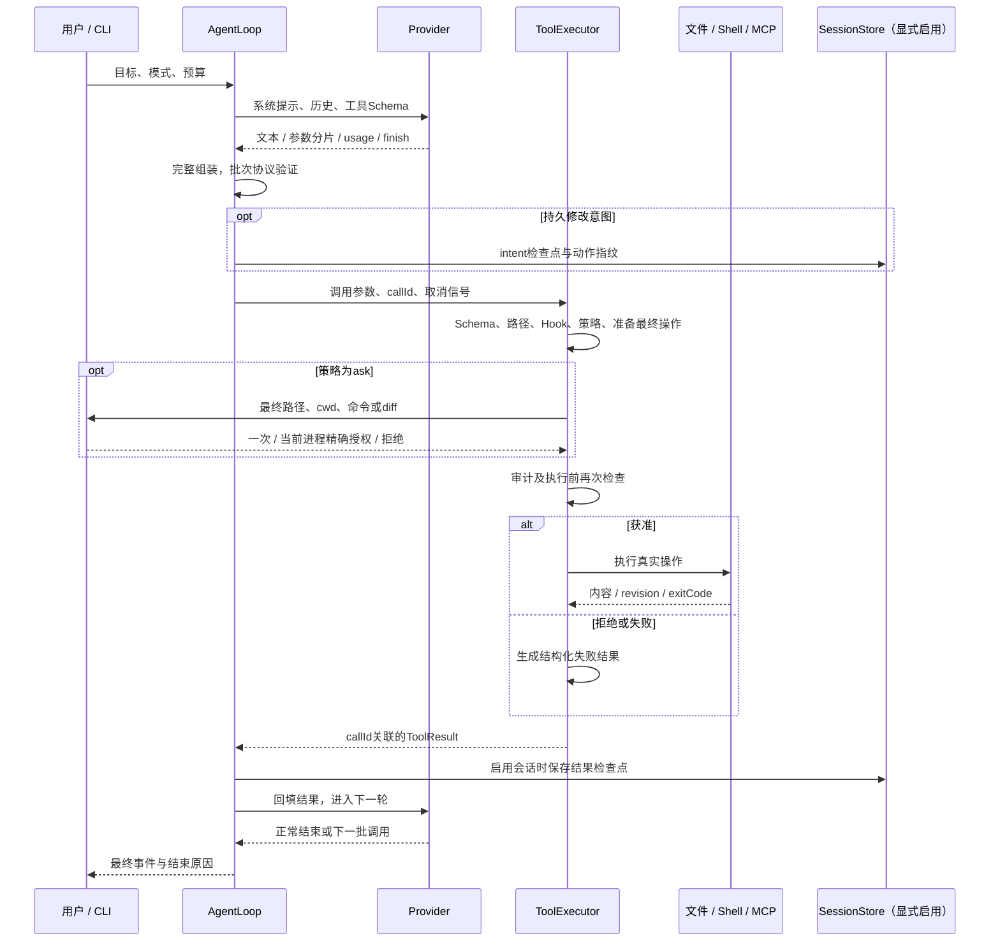
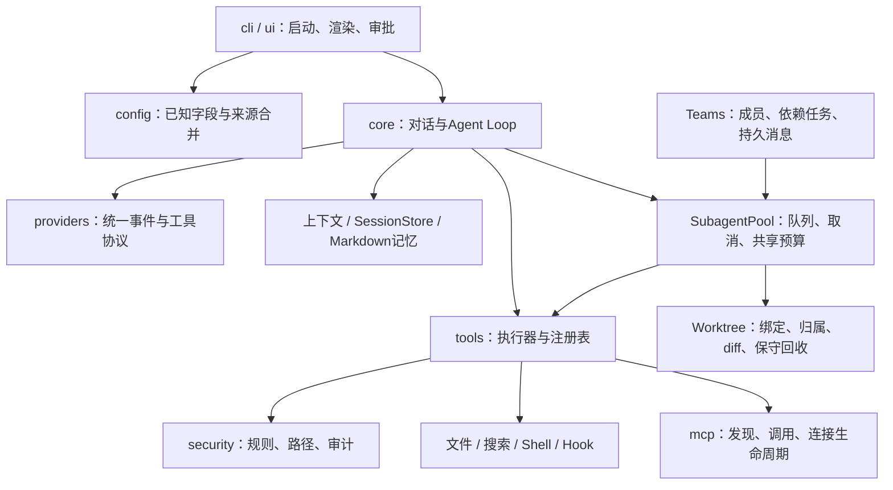

# 架构与技术决策

以下图展示当前代码的主要调用关系，不把早期规划里的可选方向画成已实现能力。依赖边界通过dependency-cruiser检查，核心/config/provider不依赖CLI或UI；shared保持基础模块。详细工程复盘见[M16记录](../M16/architecture-review.md)。

## 一次任务如何运行

普通Agent Loop按调用顺序执行工具；并发收益来自明确开启的SubagentPool。批次协议验证先检查调用标识、分片结束与JSON等格式，工具自己的Schema和路径在逐项执行器中校验；后项协议错误可以阻止整批，后项工具业务错误不回滚前项。它不能把多个真实工具动作变成事务，准备阶段与执行前重复检查也无法替代OS级隔离。

## 模块地图

这里的安全层是每个执行动作的约束，记忆层提供上下文，两者都不需要运行成单独服务。MCP SDK内部协议由SDK处理，远端数据仍受本地Schema与权限边界约束。

## 决策与代价

| 决策                             | 实现与证据                                                                                                   | 得到什么                                       | 代价与后续方向                                       |
| -------------------------------- | ------------------------------------------------------------------------------------------------------------ | ---------------------------------------------- | ---------------------------------------------------- |
| Node.js 24 + ESM + npm单包       | [package.json](../../../package.json)、[CI](../../../.github/workflows/ci.yml)                               | 锁文件安装、标准fs/流/子进程API、三平台工具链  | 需要Node与rg，非独立二进制；后续先保持兼容           |
| 自行实现Agent Loop，provider独立 | [agent-loop](../../../src/core/agent-loop.ts)、[协议测试](../../../tests/integration/provider-tools.test.ts) | 可检验分片、callId、usage、停止和取消          | 协议边界维护成本高，新增provider需回归               |
| 工具统一执行与精确授权           | [executor](../../../src/tools/executor.ts)、[权限测试](../../../tests/unit/permissions.test.ts)              | deny优先、父权限约束、参数变更重新检查         | 审批成本，Shell仍有主机权限；可另研究OS沙箱          |
| revision校验 + 原子文件替换      | [files](../../../src/tools/files.ts)、[文件测试](../../../tests/unit/tools-files.test.ts)                    | 拒绝读取后文件变化和歧义替换                   | 原子单文件替换不是多文件事务，也不能消除全部外部竞态 |
| 本地结构化压缩 + JSONL检查点     | [context](../../../src/core/context.ts)、[session](../../../src/core/session.ts)                             | 零额外模型压缩请求，完整调用组与历史指纹可验证 | 摘录省略语义细节；持久日志与外部动作无原子事务       |
| Markdown记忆，不引入向量库       | [memory](../../../src/core/memory.ts)、[记忆测试](../../../tests/integration/memory-store.test.ts)           | 显式确认、可编辑、预算与来源可解释             | 本地筛选不是语义召回保证，后续需单独评估检索         |
| SubAgent/Worktree/Teams分层      | [pool](../../../src/core/subagents.ts)、[teams](../../../src/core/teams.ts)                                  | 同一池复用权限、取消和共享预算，按需求扩展协作 | 额外请求/调度成本，工作树共享Git对象，人工合并       |
| 脚本化provider + 真实工具评估    | [固定夹具](../../../tests/support/release-evaluation.ts)                                                     | 免费、确定性地定位工程错误和跨平台差异         | 不能测真实模型任务质量、费用和推理能力               |

## 状态和停止如何解释

普通工具循环正常文本结束对应completed；模型截断对应length；轮数、累计token和连续失败分别对应max_turns、token_budget、repeated_failures。协议错误、上下文无法容纳、取消与超时走分类错误，不能统一称为“成功结束”。UI将错误/取消恢复到可输入状态，已完成文件修改保留。[循环测试](../../../tests/integration/agent-loop.test.ts)与[UI测试](../../../tests/unit/chat-ui.test.tsx)分别覆盖这些行为。

会话记录动作指纹与意图，恢复后拒绝已记载的相同修改动作。外部动作可能成功而记录未完成，因此未知状态先核验；团队unknown/uncertain恢复保守消耗预留预算，再由用户明确retry。没有全局exactly-once保证，不能用“恢复不重放”替代对外部状态的检查。

## 何时使用协作

| 方式         | 任务与状态                         | 可执行能力                          | 交付与成本                                             |
| ------------ | ---------------------------------- | ----------------------------------- | ------------------------------------------------------ |
| 普通run      | 一项任务、一个上下文               | 获准的文件/Shell/MCP等工具          | 最少编排，顺序工具；适合小修复                         |
| 只读SubAgent | 有界子会话、FIFO池、深度1          | Plan，ReadFile/Glob/Grep，继承限制  | 核验观察与摘要，额外模型和父汇总成本                   |
| Worktree任务 | 子会话绑定固定基准的归属工作树     | 获准文件修改；Shell需显式工具和批准 | diff、真实检查，保留脏目录/分支；依赖不自动安装        |
| Teams        | 持久成员、依赖任务、消息与累计预算 | 复用绑定工作树的子池和父权限        | 本地确定性调度，消息不自动派任务，无后台成员或自动合并 |

同成员任务串行，独立成员可在池限额内并行。仅当任务可分、证据能核验、收益大于额外请求和汇总成本时选择协作；固定模拟并发数据不能推导真实费用收益。
